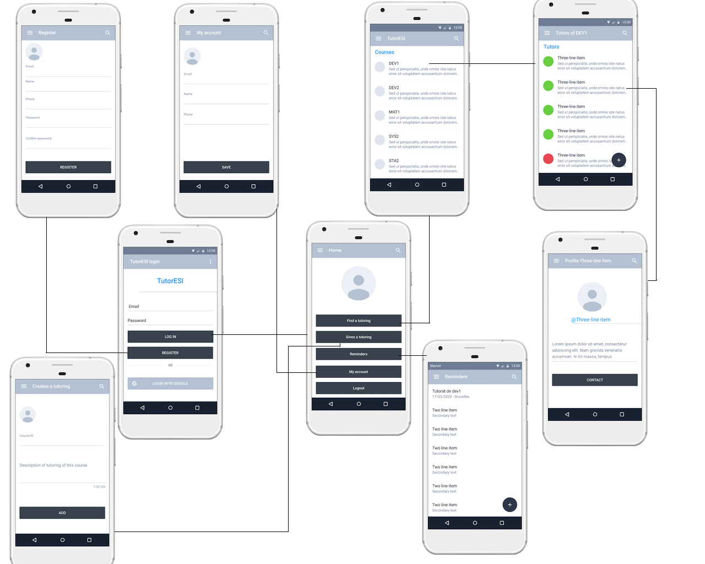

# TutorESI

TutorESI is an android application that allows students to find tutors in different courses.

## Description

Students will be able to contact the tutors via the application.
A grading system is also present which will allow students' experience with a tutor to be graded.
It is also possible to add reminders via the Reminder menu so that you don't forget a tutoring appointment for example.

## Layout

